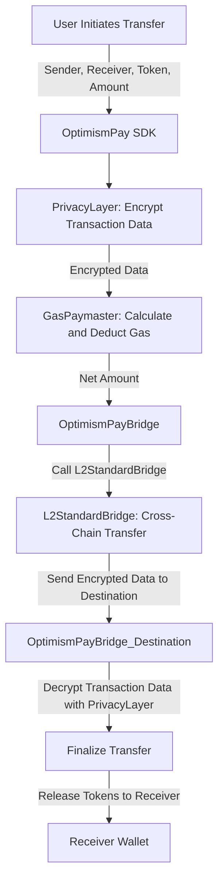

# **OptimismPay: Crypto Pay Master**

---

## **Introduction**

**OptimismPay** is a groundbreaking project designed to revolutionize cross-chain transactions by:
- Eliminating the need for users to hold native tokens for gas.
- Ensuring privacy and security through **Fully Homomorphic Encryption (FHE)** powered by **Zama FHEVM**.
- Enabling seamless interoperability across networks in the **Optimism Superchain**.

By combining advanced encryption techniques, a modular SDK, and compatibility with the **OP Stack**, **OptimismPay** is a developer-friendly solution for wallets, dApps, and exchanges.

---

## **Key Features**

1. **Gasless Experience:**
   - Automatically deducts gas fees from the token being transferred, simplifying user interactions with blockchain networks.

2. **Privacy-Preserving Transactions:**
   - Utilizes **Zama’s Fully Homomorphic Encryption (FHE)** to encrypt sensitive transaction details, ensuring they remain private throughout the transfer process.

3. **Cross-Chain Interoperability:**
   - Built on the **L2StandardBridgeInterop**, enabling seamless token transfers across networks in the Optimism Superchain (e.g., Optimism, Base, Sepolia).

4. **Developer-Friendly SDK:**
   - A TypeScript-based SDK simplifies integration with wallets and dApps by abstracting contract interactions.

5. **Modular Architecture:**
   - Composed of reusable components, including gas management, encryption layers, and token validation.

---

## **Problem Statement**

Transacting across multiple blockchain networks often requires users to hold native tokens to pay gas fees. This creates several challenges:
- **New Users:** Frustration due to insufficient gas tokens.
- **Accessibility:** Limited on-ramps for acquiring native tokens in certain regions.
- **Fragmentation:** Unused native tokens accumulating across different networks.

**OptimismPay** solves these problems by enabling users to pay gas fees directly from the token being transferred, providing a seamless, gasless, and private cross-chain experience.

---

## **How It Works**

The system combines multiple smart contracts and Zama’s FHE to ensure private, gasless, and cross-chain token transfers.

### **Flow Diagram**



### **Workflow Breakdown**
1. **Privacy Preservation:**
   - Sensitive transaction data is encrypted on-chain using Zama's FHE before transfer initiation.
2. **Gas Fee Deduction:**
   - The `GasPaymaster` contract dynamically calculates and deducts gas fees from the user's token balance.
3. **Cross-Chain Messaging:**
   - The `OptimismPayBridge` contract interacts with the `L2StandardBridge` to handle token and encrypted data transfers.
4. **Decryption and Finalization:**
   - On the destination chain, encrypted data is decrypted to finalize the transfer securely.

---

## **Project Structure**

The **OptimismPay** project is organized as a monorepo for better modularity and scalability.

```plaintext
📦 optimismpay-monorepo
├── 📁 apps
│   ├── 📁 frontend       # Demo wallet interface (Next.js)
│   ├── 📁 backend        # API for managing transactions (Node.js)
├── 📁 packages
│   ├── 📁 contracts      # Smart contracts and deployment scripts (Hardhat)
│   │   ├── ConfigManager.sol
│   │   ├── GasPaymaster.sol
│   │   ├── OptimismPayBridge.sol
│   │   └── PrivacyLayer.sol
│   ├── 📁 sdk            # Developer SDK for interacting with the system (TypeScript)
│   │   ├── integrations
│   │   │   ├── dAppAPI.ts       # APIs for dApp integrations
│   │   │   └── walletAPI.ts     # APIs for wallet integrations
│   │   ├── encryption
│   │   │   ├── fheEncrypt.ts    # Zama FHE encryption utilities
│   │   │   └── fheDecrypt.ts    # Zama FHE decryption utilities
│   │   └── utils
│   │       ├── networkUtils.ts  # Network utilities for fetching gas prices
│   │       └── tokenUtils.ts    # Token validation utilities
│   ├── 📁 shared         # Shared constants, types, and helpers
├── turbo.json            # TurboRepo configuration for monorepo management
├── pnpm-workspace.yaml   # Workspace configuration for pnpm
└── package.json          # Global dependencies and project metadata
```

---

## **Installation**

### Prerequisites
- Node.js (v16+)
- `pnpm` for monorepo management
- Infura, Alchemy, or other RPC provider for network access

### Steps
1. **Clone the Repository:**
   ```bash
   git clone https://github.com/AndreaDiazCorreia/Optimism-pay.git
   cd Optimism-pay
   ```

2. **Install Dependencies:**
   ```bash
   pnpm install
   ```

3. **Set Up Environment Variables:**
   Create a `.env` file in the root directory using the provided `.env.example` template.

4. **Run the Development Environment:**
   ```bash
   pnpm dev
   ```

---

## **Testing**

1. **Unit Tests:**
   ```bash
   pnpm test
   ```

2. **Manual Testing:**
   Deploy the contracts on testnets like Optimism Goerli or Sepolia and initiate transactions via the SDK.

---

## **Roadmap**

### **Phase 1: MVP Completion (Current Phase)**
🟢 Cross-chain token transfers using Optimism's `L2StandardBridge`.
🟢 Privacy-preserving transactions with Zama FHE.
🟢 Initial SDK with core functionalities.

### **Phase 2: SDK Refinement**
🟡 Enhanced API documentation and modularization.
🟡 Improved error handling and token validation logic.

### **Phase 3: Network Expansion**
🟡 Add support for zkSync, Polygon Supernets, and other Superchain networks.

### **Phase 4: Advanced Privacy Features**
🔵 Integrate zk-SNARKs for zero-knowledge transaction proofs.

### **Phase 5: Ecosystem Tools**
🔵 Build browser extensions and plugins for ecommerce platforms.

---

## **Acknowledgments**

This project leverages the following technologies:
- **Zama FHEVM:** For privacy-preserving encryption and decryption.
- **Optimism L2StandardBridge:** For seamless cross-chain interoperability.
- **Hardhat:** For contract development and testing.
- **TurboRepo:** For efficient monorepo management.

Developed during the **Aleph de Verano Hackathon 2024**, the project aims to enhance blockchain accessibility and usability.

---

## **License**

This project is licensed under the [MIT License](./LICENSE).

---

## **Contact**

For questions or issues, open an issue on [GitHub](https://github.com/AndreaDiazCorreia/Optimism-pay/issues).

## **Social Media**

Follow us on [Social Media](https://linktr.ee/optimismpaymaster) for updates and announcements.

---

**Happy Building 🚀!**
